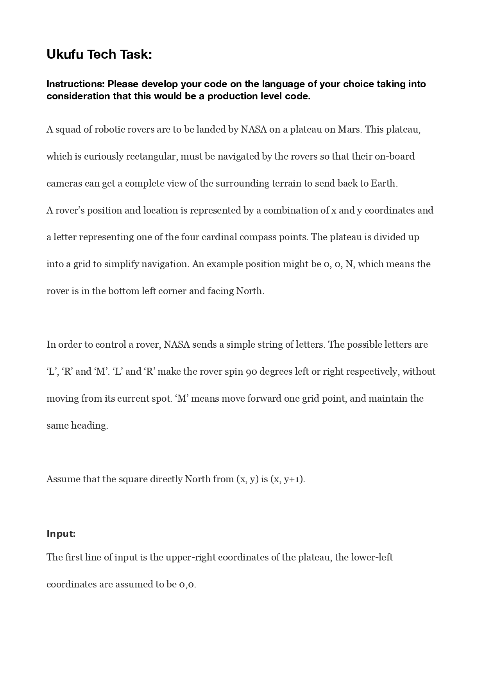
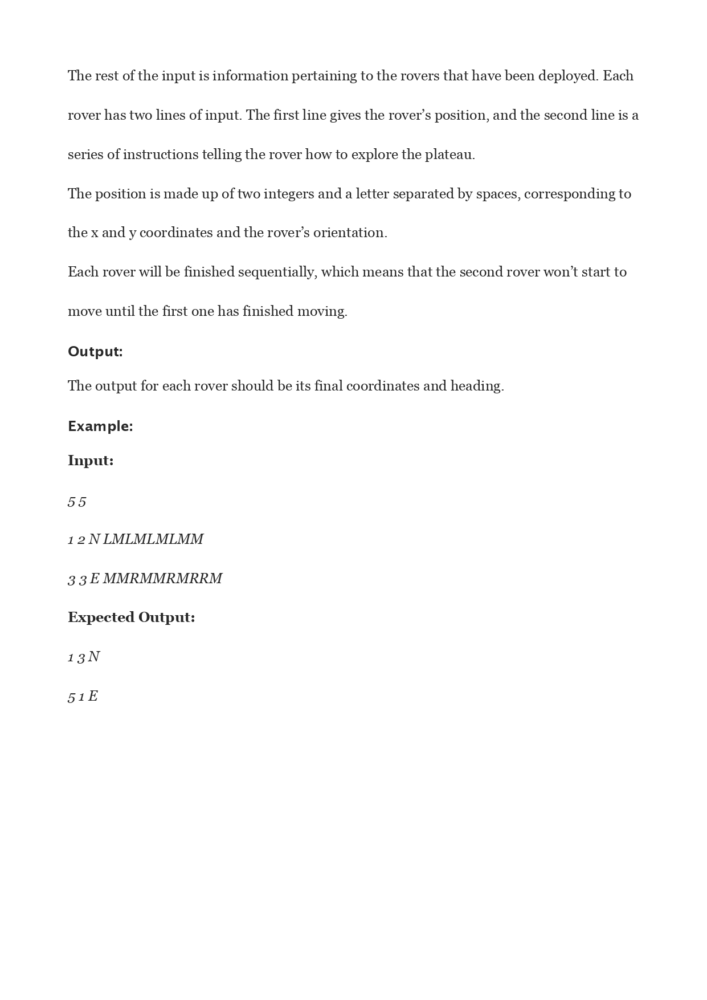

# Rover_tracker

Given a robotic rover and initial position, as well as moves taken, find the end position.

#### Example:
Input:
5 5
1 2 N LMLMLMLMM
3 3 E MMRMMRMRRM

Expected Output:
1 3 N
5 1 E

#### Running locally
- Clone this repo and inside the project folder run `ruby rover_tracker.rb`